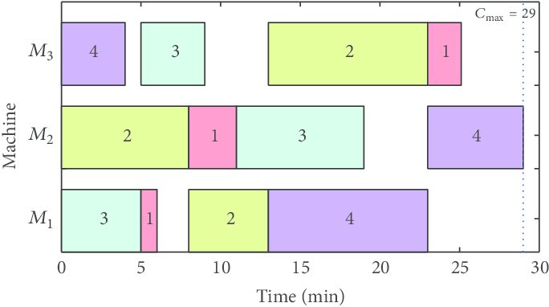
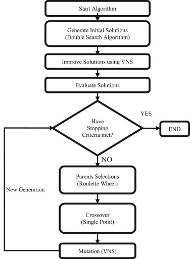

# Scheduling problem in operational research. 

## Table of Contents  

[Problem's Description](#problem's-description)  

[Solution's description ](#Solution's-description )  

[Objectif](#objectif)  

[Solution 1 : Dynamic Programming (recursive) approach](#Solution-1-:-Dynamic-Programming-(recursive)-approach)  

[Solution 2 : Metaheuristic approach VNS : Variable Neighborhood Search](#Solution-2-:-Metaheuristic-approach-VNS-:-Variable-Neighborhood-Search)

[About the files (input and output)](#About-the-files-(input-and-output))  

[The input](#input) 

[The output](#the-output) 

## Problem's description

A scheduling problem is a classic problem in operations research which consists in organizing the performance of tasks over time, considering time constraints (deadlines, sequencing constraints) and constraints relating to the availability of the required resources. 



## Solution's description :

I implemented two different solutions to the scheduling problem. It is defined by scheduling for each task an execution time of a "sequence of tasks performed one after the other".

Each task has a start and end date, which requires a minimal execution time (denoted in the scripts P), a due date denoted (D), which each task has to be executed before its own due date.

## Objectif :

The objectif if to find the better sequence of tasks which gives the minimal delay (penalty) if we exceed each task's due date, in a way that we minimize the total execution time or the average time to complete a set of tasks, and minimize delays if they exist.

## Solution 1 : Dynamic Programming (recursive) approach :

This solutions implements a set of mathematical and algorithmic tools to study the processes of sequential decisions and possibly calculate exact optimal strategies. 

A policy (or strategy) is a decision-making rule which, for each possible situation (state of the system), tells us what decision (or action) to take in the aim to optimize an overall objective function.

Often, the objective function is a mathematical expectation. Sometimes we can characterize the optimal policy by theorems, often it can be calculated, or calculate an approximation; in some cases (Large size problem) the resolution will be too difficult.

This approach is implemented in the script : ```ordo_Dynamique_Iterative.py ``` [More details in the script's comments].

## Solution 2 : Metaheuristic approach VNS : Variable Neighborhood Search :

A metaheuristic is an optimization algorithm used for solving problems difficult to optimize (often in operational research, engineering or artificial intelligence) for which no method is known classic more efficient.

There are a lot of different metaheuristics, ranging from simple search local to complex global search algorithms, to solve our scheduling problem I will use the neighborhood search method variable variable neighborhood search.

Variable Neighborhood Research (RVV) was proposed by Mladenovic and Hansen in 1997 which methodically uses several types of neighborhood structures. 

 

In this project, I used 3 neighborhood structures: L = (N (1), N (2), N (3)) a list of finite neighborhoods such as:

    1- N(1) represents the permutation;
    2- N(2) represents the insertion;
    3- N(3) represents the left pivot. 

## About the files (input and output) ! 

<a name="input"/>

### The input :

The input data (Tasks) is stored in ```LesDonnesMeta.csv``` and  ```LesDonneesDyna.csv``` file, where each task has an execution time, a dude date, and a weight. 

A weight must be between 20% and 60% of the sum of the task's execution time This is explained more in script's comments. 

### The output :

The output using the dynamic programming and the metaheuristic is stored in the files ```resultat.txt``` and ```resultat_meta.csv``` respectively.

Text me if you need more details !
